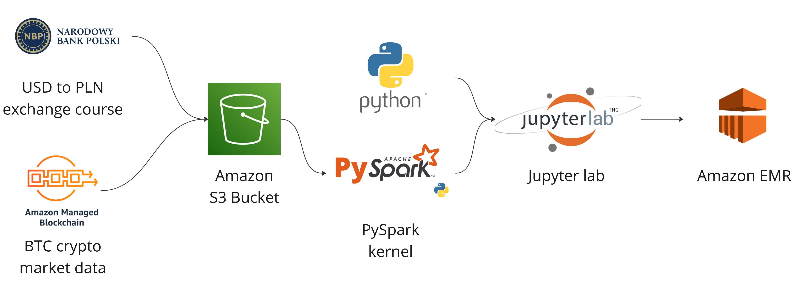

# Link to the classroom repository

# Task description and goal
Bitcoin transaction analysys including BTC to PLN archival exchange rates since January 2021 untill December 2022.

Result in form of a plot as an example of projects achievements:

# Used technologies
To achieve such data analysys we used AWS environment including usage of EMR's features - clusters and notebooks. 

Diagram below represents used technologies and features:

Most of the code is developed in Python, especially in PySpark framework API. To properly work with data we have also used such frameworks and packets like pandas, requests, matplotlib, ipython and xml-python.

# Data Sources and Data Preparation
To acomplish the task we used exchange rate of USD to PLN from the archive of NBP (Narodowy Bank Polski). Firstly we have created Python script which created work-days calendar which will match days registered in NBP database. Secondly we have created python script to download specific xml files from NBP archive and extract USD to PLN exchange rate. As the next step we have prepared the gathered data to put it into csv files and upload them onto our S3 bucket.

Data containing information about BTC transactions and USD exchange rates was gathered from Amazon Public-Blockchain-Marketdata. To use the data in the correct way we had to sort and filter out the data and extract it from database. We have also prepared csv files containing two columns: date and BTC exchange rate in both currencies.

# Visualization
The have prepared plots from prepared data to easily visualize the results of our project

